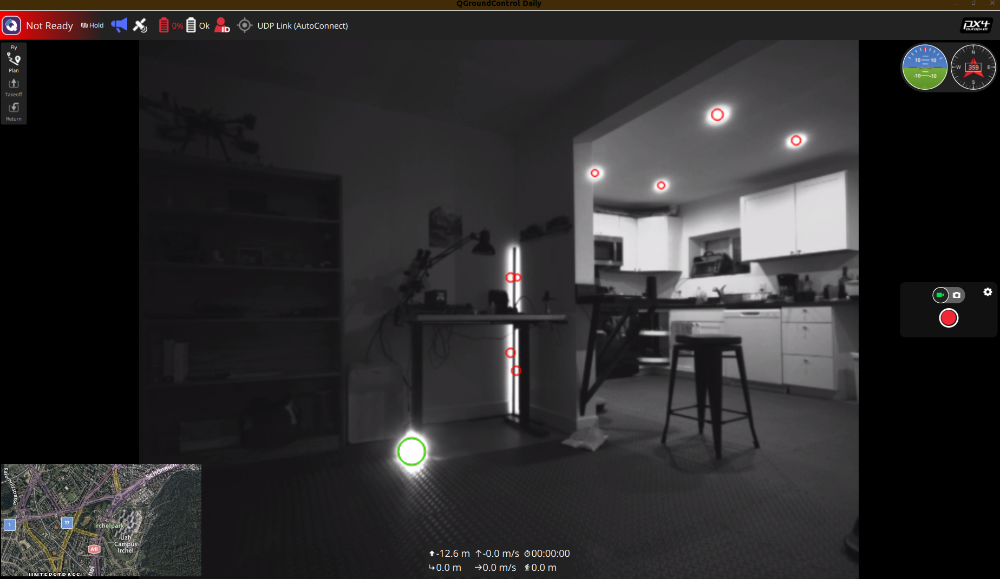

# IR Contour Detection
Circles contours with radius above threshold in red. Largest radius circled in green.

### Build
```
colcon build --packages-select bright_spot_detector
```
### Launch
```
ros2 launch bright_spot_detector realsense.launch.py
```
### Adjust parameters
```
ros2 param set bright_spot_detector area_threshold 100
```

### GStreamer h.264 UDP
Add the [ros-gst-bridge](https://github.com/BrettRD/ros-gst-bridge) to your workspace.
```
TARGET_IP=192.168.1.31 # add your host PC IP here
TARGET_PORT=5600 #

./gstreamer.sh

```

TODO:
camera intrinsics:
```
rs-enumerate-devices -c
```


